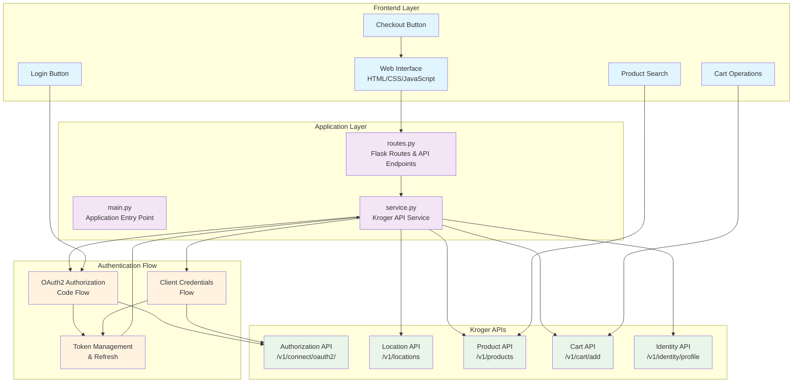
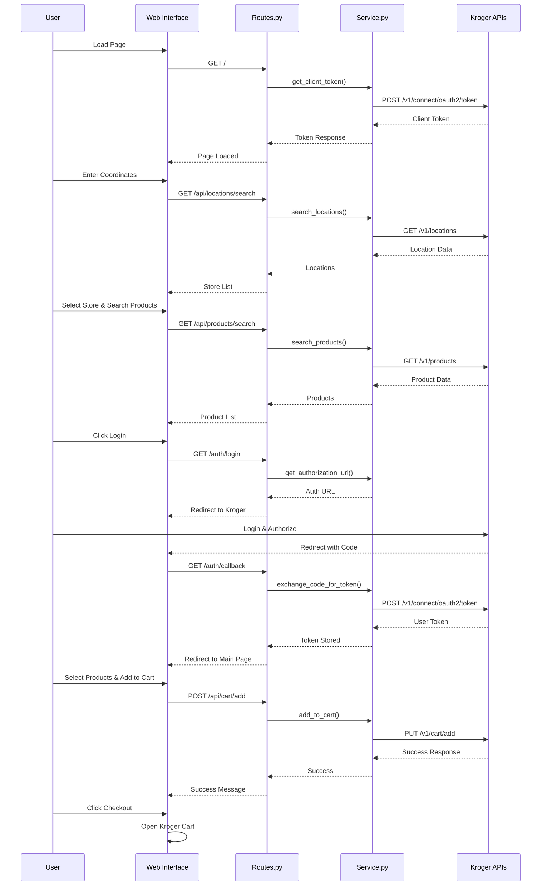
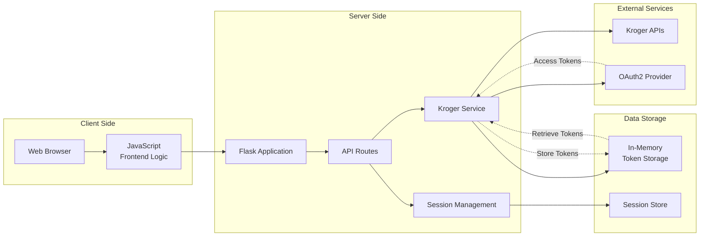
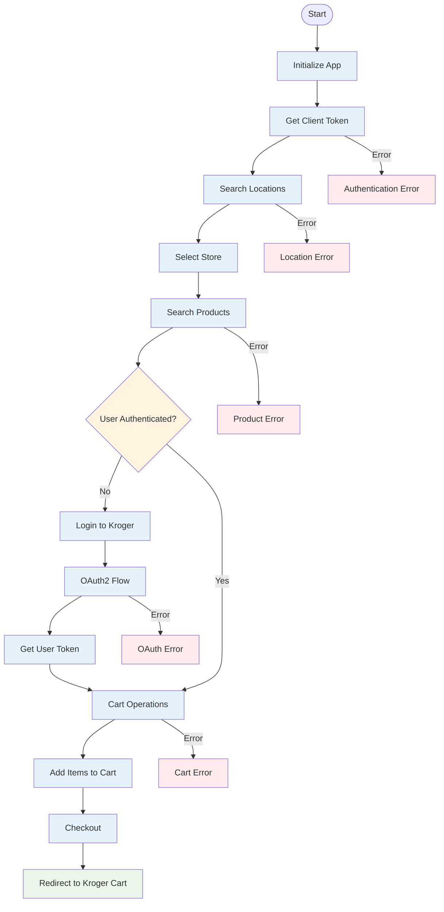

# Kroger API Integration Architecture

## System Architecture Diagram

## Detailed Component Flow

## Data Flow Architecture

## API Integration Flow

## Component Responsibilities

### Frontend Layer
- **Web Interface**: User interaction and display
- **JavaScript**: Client-side logic and API calls
- **UI Components**: Login, search, cart, checkout buttons

### Application Layer
- **main.py**: Application entry point and configuration
- **routes.py**: Flask routes and API endpoints
- **service.py**: Core Kroger API integration logic

### Authentication Layer
- **OAuth2 Flow**: User authentication with Kroger
- **Client Credentials**: App-level authentication
- **Token Management**: Automatic token refresh and storage

### External APIs
- **Authorization API**: Token management
- **Location API**: Store search and details
- **Product API**: Product search and details
- **Cart API**: Cart operations
- **Identity API**: User profile information

## Key Features

1. **Modular Architecture**: Clear separation of concerns
2. **Token Management**: Automatic refresh and session handling
3. **Error Handling**: Comprehensive error management
4. **Session Management**: Persistent user sessions
5. **API Integration**: Complete Kroger API coverage
6. **User Experience**: Seamless authentication flow
